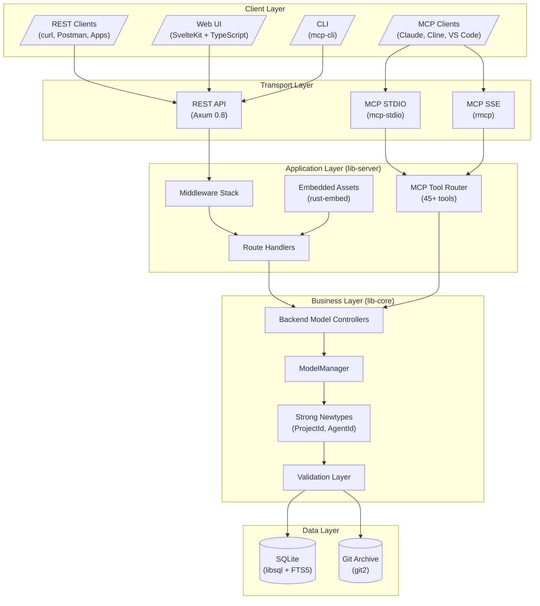
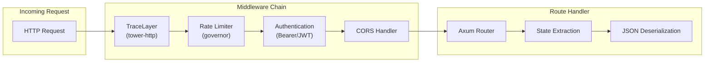
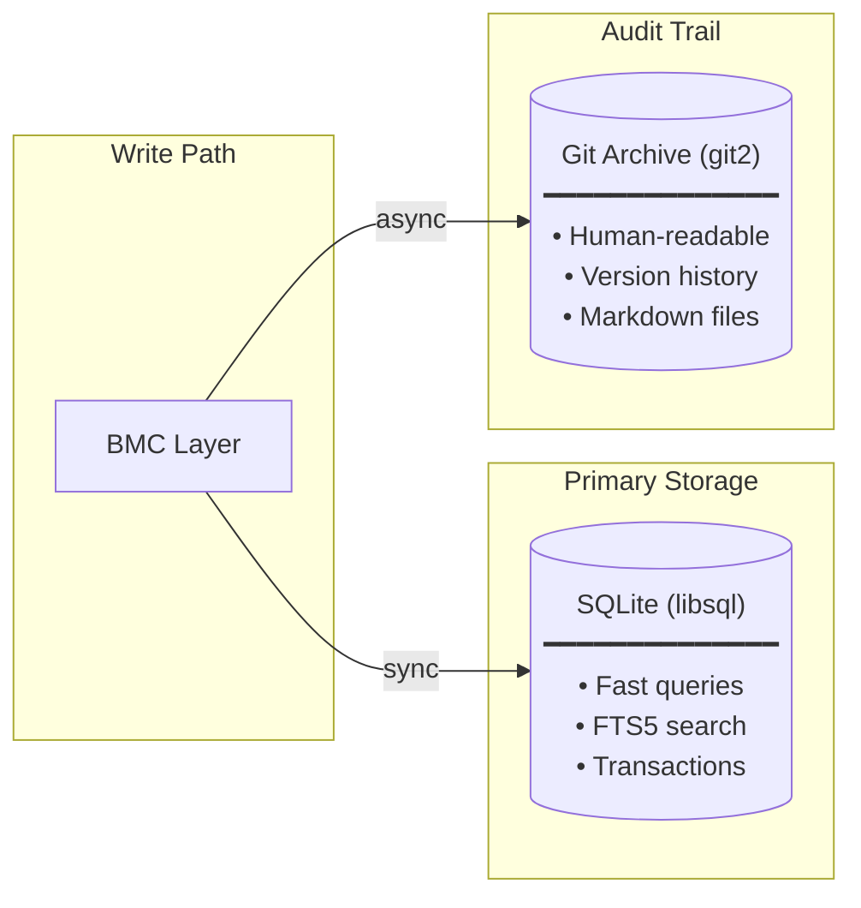
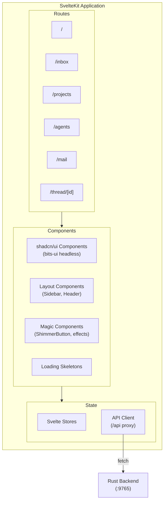
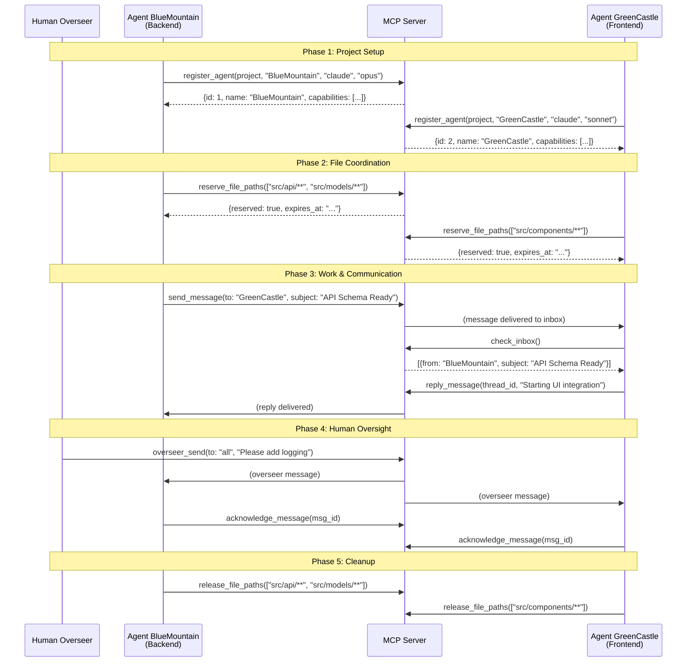
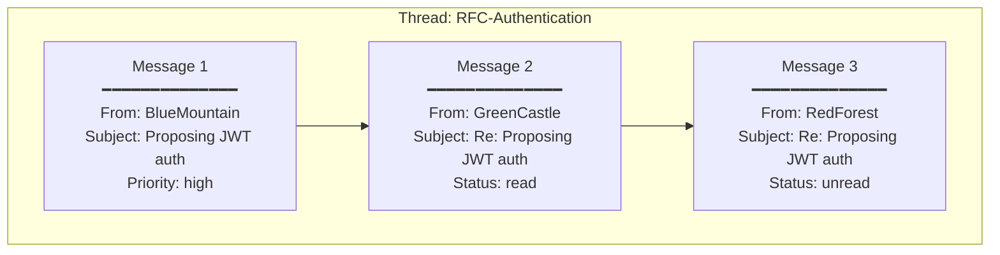
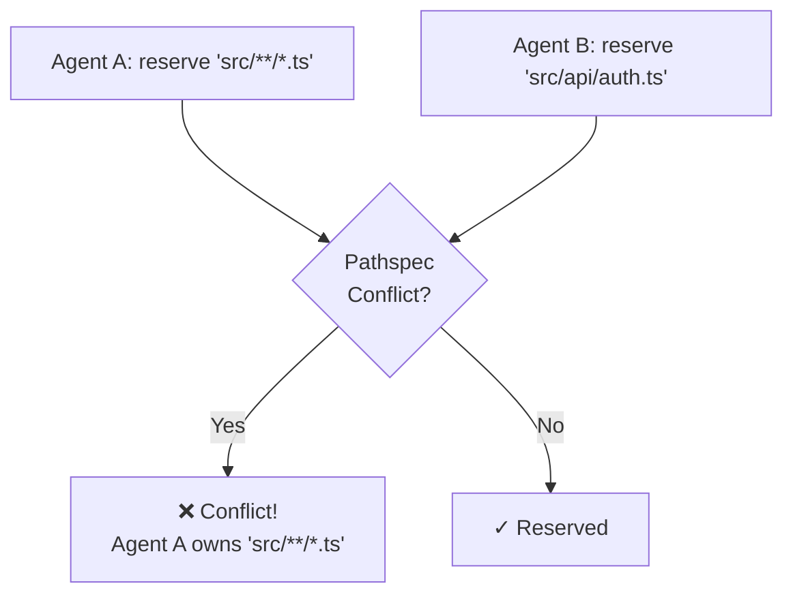
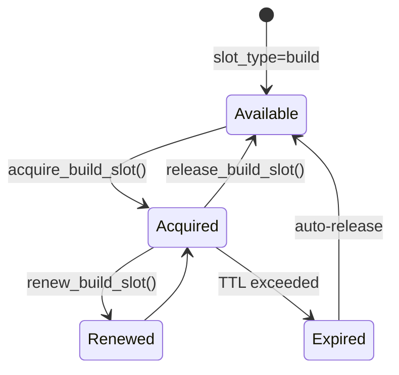
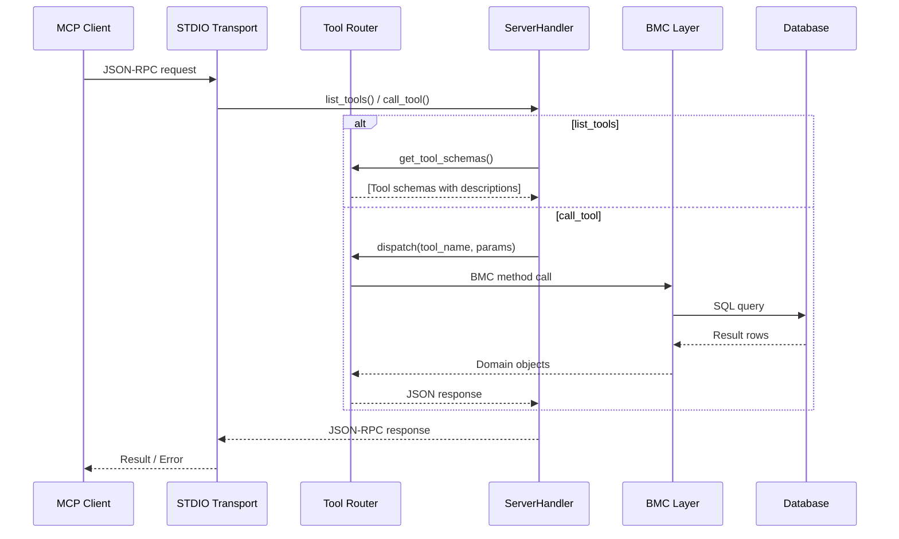

# MCP Agent Mail (Rust)

> "Gmail for your coding agents" — High-performance async messaging for AI agent coordination

[](https://www.rust-lang.org)
[](LICENSE)

A production-grade Rust implementation of a mail-like coordination layer for AI coding agents, exposed as both REST API and MCP (Model Context Protocol) server. Enables asynchronous communication between multiple agents working on shared codebases with full audit trails.

**44.6x faster than Python** — 15,200 req/s vs 341 req/s in original implementation.

**Ported from**: [mcp_agent_mail (Python)](https://github.com/Dicklesworthstone/mcp_agent_mail)

---

## Table of Contents

- [Why This Exists](#why-this-exists)
- [Architecture Overview](#architecture-overview)
- [Agent Communication Flow](#agent-communication-flow)
- [Quick Start](#quick-start)
- [Project Structure](#project-structure)
- [API Reference](#api-reference)
- [MCP Protocol](#mcp-protocol)
- [Configuration](#configuration)
- [Development](#development)
- [Performance](#performance)
- [References](#references)

---

## Why This Exists

Modern projects often run multiple coding agents simultaneously (backend, frontend, scripts, infra). Without coordination, agents:

- Overwrite each other's edits or panic on unexpected diffs
- Miss critical context from parallel workstreams
- Require humans to "liaison" messages across tools

MCP Agent Mail provides:

| Feature | Description |
|---------|-------------|
| **Agent Identity** | Memorable adjective+noun names (BlueMountain, GreenCastle) |
| **Messaging** | GitHub-Flavored Markdown messages with threading, To/CC/BCC |
| **File Reservations** | Advisory locks to prevent edit conflicts (pathspec support) |
| **Contact Management** | Explicit approval for cross-project messaging |
| **Searchable Archives** | FTS5 full-text search across message bodies |
| **Git-Backed Audit Trail** | All messages persisted for human review |
| **Build Slot Management** | Exclusive build resource locks |
| **Macro System** | Reusable workflow definitions |
| **Product Aggregation** | Cross-project inbox for related repositories |

---

## Architecture Overview

### System Layers



### Middleware Stack



### Backend Model Controller (BMC) Pattern

The BMC pattern separates concerns for each entity with stateless controllers and strong newtypes:

```
┌─────────────────────────────────────────────────────────────────┐
│                    Strong Newtypes (lib-core/types.rs)           │
├─────────────────────────────────────────────────────────────────┤
│  ProjectId(i64)    │ Compile-time safe project ID               │
│  AgentId(i64)      │ Compile-time safe agent ID                 │
│  MessageId(i64)    │ Compile-time safe message ID               │
│  ProjectSlug(String) │ URL-safe project identifier              │
│  AgentName(String) │ Agent name identifier                      │
├─────────────────────────────────────────────────────────────────┤
│                    Data Structures                               │
├─────────────────────────────────────────────────────────────────┤
│  Agent              │  AgentForCreate    │  AgentForUpdate       │
│  ├─ id: AgentId     │  ├─ name           │  ├─ program          │
│  ├─ name            │  ├─ project_id     │  └─ model            │
│  ├─ project_id      │  ├─ program        │                       │
│  └─ created_at      │  └─ model          │                       │
├─────────────────────────────────────────────────────────────────┤
│                    BMC Controller (Stateless)                    │
├─────────────────────────────────────────────────────────────────┤
│  AgentBmc::create(ctx, mm, data) -> Result<AgentId>             │
│  AgentBmc::get(ctx, mm, id: AgentId) -> Result<Agent>           │
│  AgentBmc::get_by_name(ctx, mm, ProjectId, name) -> Result<Agent> │
│  AgentBmc::list_for_project(ctx, mm, ProjectId) -> Result<Vec<Agent>> │
│  AgentBmc::update(ctx, mm, AgentId, data) -> Result<()>         │
└─────────────────────────────────────────────────────────────────┘
```

### Dual Persistence Model

All data is stored in both systems for query performance and audit trail:



**Git Archive Structure:**
```
data/archive/projects/{slug}/
├── agents/{name}/
│   ├── profile.json
│   ├── inbox/YYYY/MM/{message}.md
│   └── outbox/YYYY/MM/{message}.md
├── messages/YYYY/MM/{timestamp}__{subject}__{id}.md
└── threads/{thread_id}/
    └── {message_id}.md
```

### Frontend Architecture (SvelteKit)



**UI Component Categories:**
| Category | Components |
|----------|------------|
| **Primitives** | Button, Card, Input, Badge, Checkbox, Tooltip |
| **Layout** | Sidebar, Sheet, Tabs, Pagination, Resizable |
| **Data** | Table, Command Palette, Filter Combobox |
| **Feedback** | Skeleton, Alert, Progress, Status Indicator |
| **Effects** | ShimmerButton, Spotlight, Theme Toggle |

---

## Agent Communication Flow

### Typical Multi-Agent Workflow



### Message Threading



### File Reservation Conflict Detection



### Build Slot Coordination



---

## Quick Start

### Prerequisites

- **Rust** 1.85+ (Edition 2024)
- **Bun** 1.0+ (for SvelteKit frontend)

```bash
# Install Bun (macOS/Linux)
curl -fsSL https://bun.sh/install | bash

# Optional: Install cargo-deny for dependency auditing
cargo install cargo-deny
```

### Development Setup

```bash
# Clone the repository
git clone https://github.com/Avyukth/mcp-agent-mail-rs
cd mcp-agent-mail-rs

# Build all Rust components
cargo build --workspace

# Install frontend dependencies
cd crates/services/web-ui && bun install && cd ../../..

# Run development servers
make dev-backend    # Terminal 1: API on :9765
make dev-frontend   # Terminal 2: SvelteKit with HMR on :5173
```

Development servers:
- **API Server**: http://localhost:9765
- **Web UI**: http://localhost:5173 (SvelteKit with HMR, proxies to API)

### Production Build

```bash
# Build unified binary with embedded UI
make build-sidecar

# Run production server (embedded SvelteKit UI)
./target/release/mcp-agent-mail serve http --port 8765

# Or install globally as 'am'
make install-am-full
am serve http --port 8765
```

### Unified CLI

```bash
# Install globally
cargo install --path crates/services/mcp-agent-mail

# Server modes
mcp-agent-mail serve http              # REST API server
mcp-agent-mail serve mcp               # MCP stdio server
mcp-agent-mail serve mcp --transport sse --port 3000  # SSE server

# Utilities
mcp-agent-mail tools                   # List MCP tools
mcp-agent-mail schema                  # Export JSON schema
```

### Claude Desktop Integration

Add to `~/.config/claude/claude_desktop_config.json`:

```json
{
  "mcpServers": {
    "agent-mail": {
      "command": "/path/to/mcp-agent-mail",
      "args": ["serve", "mcp", "--transport", "stdio"]
    }
  }
}
```

---

## Project Structure

```
mcp-agent-mail-rs/
├── crates/
│   ├── libs/
│   │   ├── lib-core/             # Domain logic, BMC pattern, storage
│   │   │   ├── src/model/        # 15+ entities (Agent, Message, Project, etc.)
│   │   │   ├── src/store/        # Database (libsql) + Git (git2) storage
│   │   │   ├── src/types.rs      # Strong newtypes (ProjectId, AgentId, etc.)
│   │   │   └── src/utils/        # Validation, pathspec matching
│   │   ├── lib-common/           # Config, errors, tracing
│   │   ├── lib-server/           # Axum REST API, middleware, OpenAPI
│   │   │   ├── src/api.rs        # 70+ REST endpoints
│   │   │   ├── src/auth.rs       # Bearer/JWT authentication
│   │   │   ├── src/ratelimit.rs  # Rate limiting (governor)
│   │   │   └── src/embedded.rs   # rust-embed for SvelteKit assets
│   │   └── lib-mcp/              # MCP tool definitions
│   │       ├── src/lib.rs        # AgentMailService with #[tool_router]
│   │       ├── src/tools/        # Tool modules (45+ tools)
│   │       └── src/params.rs     # Auto-generated schemas (JsonSchema)
│   ├── services/
│   │   ├── mcp-server/           # REST API server binary
│   │   ├── mcp-stdio/            # MCP protocol server (stdio + SSE)
│   │   ├── mcp-cli/              # CLI for testing
│   │   ├── mcp-agent-mail/       # Unified CLI binary (with embedded UI)
│   │   ├── web-ui/               # SvelteKit frontend (TypeScript)
│   │   │   ├── src/routes/       # SvelteKit routes (inbox, projects, agents)
│   │   │   ├── src/lib/components/  # shadcn/ui-style components
│   │   │   └── static/           # Static assets
│   │   └── web-ui-leptos/        # Legacy Leptos WASM frontend
│   └── tests/
│       └── e2e/                  # Playwright E2E tests
├── migrations/                   # SQLite schema (4 migrations, FTS5)
├── data/                         # Runtime data (SQLite DB, Git archive)
├── deny.toml                     # Dependency policy (licenses, advisories)
└── .clippy.toml                  # Clippy configuration
```

### Tech Stack

| Layer | Technology |
|-------|------------|
| **Backend** | Rust 2024, Axum 0.8, Tokio |
| **Database** | libsql (SQLite) with FTS5 full-text search |
| **Storage** | git2 for audit trail |
| **Protocol** | MCP via rmcp SDK (stdio + SSE) |
| **Frontend** | SvelteKit 2.0, TypeScript 5.0, TailwindCSS 3.4 |
| **Components** | shadcn/ui-style (bits-ui), Lucide icons |
| **Build** | Vite 6.0, Bun, rust-embed (embedded assets) |
| **Metrics** | Prometheus (metrics-exporter-prometheus) |
| **Testing** | Playwright (E2E), cargo test (unit/integration) |
| **Quality** | cargo-deny, clippy, pmat |

---

## API Reference

### Health & Monitoring

| Endpoint | Method | Description |
|----------|--------|-------------|
| `/api/health` | GET | Health check with uptime |
| `/api/ready` | GET | Readiness probe (DB connectivity) |
| `/api/metrics` | GET | Prometheus metrics |

### Projects

| Endpoint | Method | Description |
|----------|--------|-------------|
| `/api/project/ensure` | POST | Create or get existing project |
| `/api/projects` | GET | List all projects |
| `/api/projects/{slug}/agents` | GET | List agents for project |
| `/api/project/info` | POST | Get project details |

### Agent Management

| Endpoint | Method | Description |
|----------|--------|-------------|
| `/api/agent/register` | POST | Register new agent |
| `/api/agent/whois` | POST | Lookup agent by name |
| `/api/agent/create_identity` | POST | Create with auto-generated name |
| `/api/agent/profile` | POST | Get agent profile |
| `/api/agent/capabilities` | POST | Check/grant capabilities |

### Messaging

| Endpoint | Method | Description |
|----------|--------|-------------|
| `/api/message/send` | POST | Send message (to/cc/bcc) |
| `/api/message/reply` | POST | Reply to thread |
| `/api/message/acknowledge` | POST | Acknowledge receipt |
| `/api/messages/search` | POST | Full-text search |
| `/api/inbox` | POST | List inbox messages |
| `/api/outbox` | POST | List sent messages |
| `/api/thread/summarize` | POST | Summarize thread |

### File Reservations

| Endpoint | Method | Description |
|----------|--------|-------------|
| `/api/file_reservations/paths` | POST | Reserve file paths (pathspec) |
| `/api/file_reservations/list` | POST | List active reservations |
| `/api/file_reservations/release` | POST | Release reservations |
| `/api/file_reservations/renew` | POST | Extend TTL |

### Build Slots

| Endpoint | Method | Description |
|----------|--------|-------------|
| `/api/build_slots/acquire` | POST | Acquire exclusive slot |
| `/api/build_slots/renew` | POST | Extend TTL |
| `/api/build_slots/release` | POST | Release slot |

### Products (Multi-Project)

| Endpoint | Method | Description |
|----------|--------|-------------|
| `/api/product/ensure` | POST | Create or get product |
| `/api/product/link_project` | POST | Link project to product |
| `/api/product/inbox` | POST | Cross-project inbox |

---

## MCP Protocol

### Tool Categories (45+ tools)

| Category | Tools | Description |
|----------|-------|-------------|
| **Infrastructure** | `health`, `ready`, `metrics` | Server health and monitoring |
| **Project** | `ensure_project`, `list_projects`, `get_project_info` | Project lifecycle |
| **Agent** | `register_agent`, `whois`, `list_agents` | Agent identity |
| **Messaging** | `send_message`, `check_inbox`, `reply_message`, `search_messages` | Core messaging |
| **Threads** | `list_threads`, `get_thread`, `summarize_thread` | Conversations |
| **Files** | `reserve_file_paths`, `release_file_paths`, `check_paths` | File coordination |
| **Build** | `acquire_build_slot`, `release_build_slot` | Build coordination |
| **Products** | `ensure_product`, `link_project`, `product_inbox` | Multi-project |
| **Contacts** | `add_contact`, `list_contacts`, `block_contact` | Agent routing |
| **Macros** | `register_macro`, `invoke_macro` | Workflow automation |
| **Overseer** | `overseer_send`, `overseer_inbox` | Human guidance |

### Request Flow



---

## Configuration

### Environment Variables

**Server:**
| Variable | Default | Description |
|----------|---------|-------------|
| `PORT` | 8765 | API server port |
| `MOUCHAK_SERVER__HOST` | 0.0.0.0 | Bind address |

**Logging:**
| Variable | Default | Description |
|----------|---------|-------------|
| `RUST_LOG` | info | Log level (debug, info, warn, error) |
| `LOG_FORMAT` | pretty | Log format (pretty, json) |
| `RUN_MODE` | development | Mode (development, production, test) |

**Database:**
| Variable | Default | Description |
|----------|---------|-------------|
| `SQLITE_PATH` | ./data/mcp_agent_mail.db | SQLite file path |
| `DATABASE_URL` | file:./data/mcp_agent_mail.db | Database URL |

**Git Archive:**
| Variable | Default | Description |
|----------|---------|-------------|
| `GIT_REPO_PATH` | ./data/archive | Archive location |
| `GIT_ARCHIVE_ENABLED` | false | Enable git archival |

**Rate Limiting:**
| Variable | Default | Description |
|----------|---------|-------------|
| `RATE_LIMIT_ENABLED` | true | Enable rate limiting |
| `RATE_LIMIT_RPS` | 1000 | Requests per second |
| `RATE_LIMIT_BURST` | 2000 | Burst allowance |

**MCP Protocol:**
| Variable | Default | Description |
|----------|---------|-------------|
| `MOUCHAK_MCP__TRANSPORT` | stdio | Transport (stdio, sse) |
| `MOUCHAK_MCP__PORT` | 3000 | SSE port |

---

## Development

### Commands (make)

```bash
# Development (two terminals recommended)
make dev-backend    # API server on :9765
make dev-frontend   # SvelteKit HMR on :5173 (proxies to API)

# Single server with embedded UI
make dev-web        # Build SvelteKit + serve on :8765

# Build
make build-release  # Build Rust release with LTO
make build-sidecar  # Build unified binary with embedded SvelteKit UI
make build-prod     # Full production build (UI + Rust)

# Testing
make test           # Run all integration tests
make test-fast      # Run unit tests only
make lint           # Run clippy lints

# Quality & Security
make audit          # Run cargo audit + cargo deny
make quality-gate   # Run all quality gates (fmt, lint, test, pmat)
```

### Quality Gates

**Workspace Lints:**
- `unsafe_code = "deny"` — No unsafe code allowed
- `unused_must_use = "deny"` — Enforce error handling

**Clippy Configuration:**
- Cognitive complexity threshold: 30
- Max function lines: 200
- MSRV: 1.85

**Dependency Policy (deny.toml):**
- License allowlist (MIT, Apache-2.0, BSD, ISC)
- Security advisory checks

---

## Performance

Benchmarked against Python reference implementation:

| Metric | Rust | Python | Improvement |
|--------|------|--------|-------------|
| Requests/sec | 15,200 | 341 | **44.6x** |
| P99 Latency | 2.1ms | 89ms | **42x** |
| Memory (idle) | 12MB | 180MB | **15x** |
| Startup time | 50ms | 2.1s | **42x** |

**Key Optimizations:**
- Shared `ModelManager` across MCP sessions
- Connection pooling with libsql
- Zero-copy JSON serialization
- Async I/O throughout with tokio
- LRU repo cache (8 repos) for concurrent agents

---

## Database Schema

SQLite with FTS5 full-text search. **15 tables** across 4 migrations:

| Table | Description |
|-------|-------------|
| `projects` | Project registry (slug, human_key) |
| `agents` | Agent profiles with capabilities |
| `messages` | Message content with threading |
| `message_recipients` | To/CC/BCC with read/ack tracking |
| `messages_fts` | FTS5 index for full-text search |
| `file_reservations` | Advisory file locks with TTL |
| `build_slots` | Exclusive build resource locks |
| `agent_capabilities` | Per-agent capability grants |
| `products` | Multi-repo coordination |
| `tool_metrics` | Tool usage tracking |

---

## References

- [Python Original](https://github.com/Dicklesworthstone/mcp_agent_mail) — Source implementation
- [MCP Tools Reference](https://glama.ai/mcp/servers/@Dicklesworthstone/mcp_agent_mail) — MCP tools specification
- [MCP Protocol](https://modelcontextprotocol.io) — Model Context Protocol specification
- [Beads Issue Tracker](https://github.com/steveyegge/beads) — Task tracking via `bd` CLI
- [PMAT Quality Gates](https://paiml.github.io/pmat-book/) — Production maturity analysis

---

## License

MIT License — See LICENSE file for details.

---

Built with Rust for memory safety, performance, and reliability.
